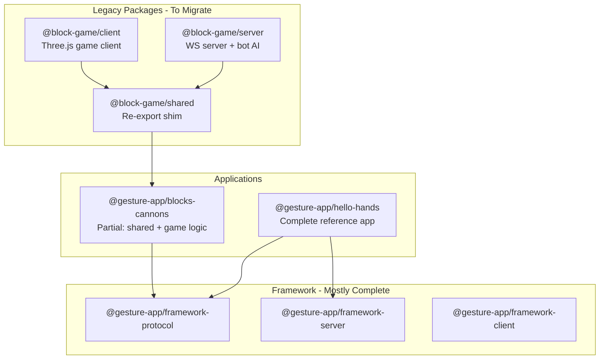
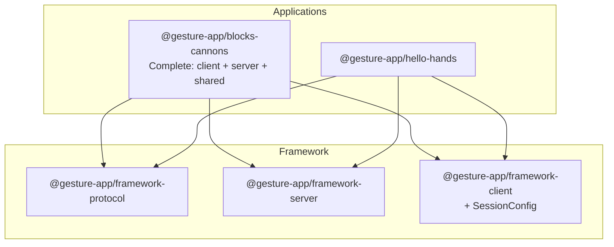

# Blocks-Cannons Migration Plan

## Current State

The codebase has legacy packages that need to be consolidated:




## Target State



---

## Phase 1: Extract Framework Code

Move generic session configuration to the framework.**Move to `@gesture-app/framework-client`:**

- [packages/client/src/config/SessionConfig.ts](packages/client/src/config/SessionConfig.ts) - Generic session config resolution

---

## Phase 2: Migrate Client to blocks-cannons

Create `packages/applications/blocks-cannons/client/` with the game client.**Files to migrate from [packages/client/](packages/client/):**| Source | Destination ||--------|-------------|| `src/main.ts` | `client/main.ts` || `src/constants.ts` | `client/constants.ts` || `src/types.ts` | `client/types.ts` || `src/styles.css` | `client/styles.css` || `index.html` | `client/index.html` || `vite.config.ts` | `client/vite.config.ts` || `src/scene/*` | `client/scene/` (BlockRenderer, EffectsManager, RoomRenderer, SceneManager) || `src/game/*` | `client/game/` (InteractionManager) || `src/input/*` | `client/input/` (HandTracker, GestureDetector, HandVisualizer) || `src/ui/*` | `client/ui/` (StatusDisplay) || `src/network/GameClient.ts` | Remove (replaced by framework SessionClient) || `tests/*` | `client/tests/` |**Update imports** to use:

- `@gesture-app/framework-client` for SessionClient, SessionConfig
- `@gesture-app/blocks-cannons/shared` for types/protocol

---

## Phase 3: Migrate Server to blocks-cannons

Move remaining server code into the application.**Files to migrate from [packages/server/](packages/server/):**| Source | Destination ||--------|-------------|| `src/server.ts` | `src/server/server.ts` (standalone entry) || `src/bot/*` | `src/server/bot/` (BotAI, BotBehavior, BotClient, BotMovement) || `src/game/GameManager.ts` | `src/server/BlocksCannonSession.ts` (refactor to AppHooks) || `src/protocol/*` | Merge into `src/shared/protocol.ts` || `src/utils/*` | `src/server/utils/` (InactivityMonitor, logger) || `tests/*` | `tests/server/` |**Refactor GameManager:**

- Extract session lifecycle → Already in `SessionRuntime`
- Keep game-specific tick logic as `AppHooks.onTick()`
- Keep bot integration

---

## Phase 4: Update Package Configuration

**[packages/applications/blocks-cannons/package.json](packages/applications/blocks-cannons/package.json):**

```json
{
  "scripts": {
    "build": "tsup src/index.ts src/shared/index.ts src/server/index.ts --format esm --dts --clean",
    "build:client": "vite build --config client/vite.config.ts",
    "dev": "tsx src/server/server.ts",
    "dev:client": "vite --config client/vite.config.ts",
    "start": "node dist/server/server.js",
    "check": "biome check --write .",
    "typecheck": "tsc --noEmit",
    "test": "vitest run",
    "test:watch": "vitest"
  },
  "dependencies": {
    "@gesture-app/framework-protocol": "^1.0.0",
    "@gesture-app/framework-server": "^1.0.0",
    "@gesture-app/framework-client": "^1.0.0",
    "@mediapipe/camera_utils": "^0.3.x",
    "@mediapipe/hands": "^0.4.x",
    "three": "^0.182.0",
    "ws": "^8.18.0",
    "yaml": "^2.8.0",
    "zod": "^4.0.0"
  }
}
```

---

## Phase 5: Cleanup

**Delete legacy packages:**

- `packages/shared/` - Re-export shim, no longer needed
- `packages/server/` - Fully migrated to blocks-cannons
- `packages/client/` - Fully migrated to blocks-cannons

**Update root [package.json](package.json):**

- Remove legacy workspace entries
- Update `build:deps` to include all apps

**Rename lobby:**

- `@block-game/lobby` → `@gesture-app/lobby` for consistency

---

## Migration Checklist

1. [ ] Move SessionConfig to framework-client
2. [ ] Create blocks-cannons/client/ structure
3. [ ] Migrate client source files
4. [ ] Migrate client tests
5. [ ] Update client imports to use framework
6. [ ] Migrate server bot system
7. [ ] Migrate server utilities
8. [ ] Refactor GameManager to AppHooks pattern
9. [ ] Migrate server tests
10. [ ] Update blocks-cannons package.json
11. [ ] Update Docker configuration
12. [ ] Delete packages/shared
13. [ ] Delete packages/server
14. [ ] Delete packages/client
15. [ ] Rename lobby package
16. [ ] Update root package.json
17. [ ] Run full validation

---

## Risk Mitigation

- **Incremental migration**: Each phase is independently testable