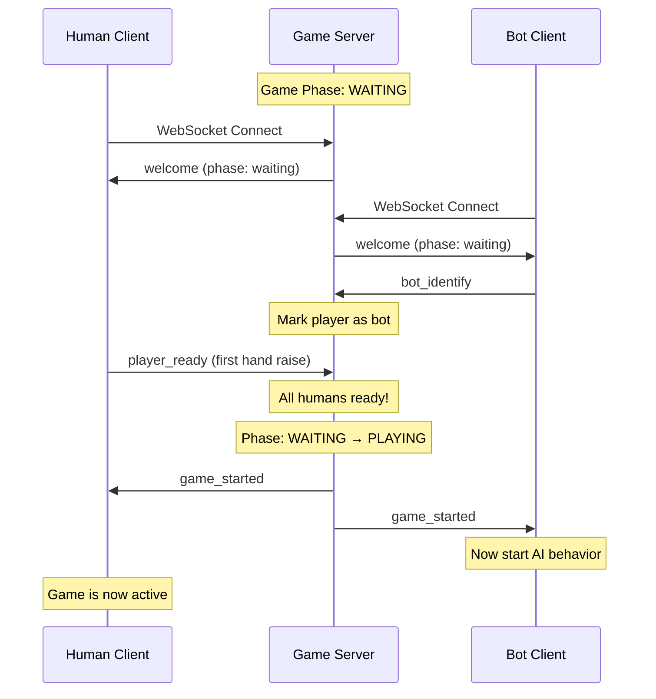

# Game Ready Phase System

## Overview

Add a readiness/phase system so the game doesn't start until all human players have performed their first hand tracking. Bots self-identify on connect and wait for the `game_started` signal before acting.

## Architecture

## Changes

### 1. Protocol Messages ([packages/shared/src/protocol/index.ts](packages/shared/src/protocol/index.ts))

Add new message types:

- **Client → Server**: `bot_identify` - Bot sends this after welcome to identify itself
- **Client → Server**: `player_ready` - Human sends this after first hand tracking
- **Server → Client**: `game_started` - Broadcast when all humans are ready
- Extend `welcome` message with `gamePhase` field

### 2. Game State ([packages/server/src/game/types.ts](packages/server/src/game/types.ts), [packages/server/src/game/GameState.ts](packages/server/src/game/GameState.ts))

- Add `GamePhase` type: `'waiting' | 'playing'`
- Add `isBot` flag to `Player` type
- Add `isReady` flag to `Player` type
- Add methods: `markPlayerAsBot()`, `markPlayerReady()`, `areAllHumansReady()`, `getGamePhase()`

### 3. Game Manager ([packages/server/src/game/GameManager.ts](packages/server/src/game/GameManager.ts))

- Track game phase in state
- In `tick()`: skip all game logic (auto-fire, projectile updates) when phase is `waiting`
- Add handlers for `bot_identify` and `player_ready` messages
- When all humans ready: transition to `playing` phase and broadcast `game_started`

### 4. Protocol Handlers ([packages/server/src/protocol/handlers.ts](packages/server/src/protocol/handlers.ts))

- Add `handleBotIdentify`: mark player as bot in state
- Add `handlePlayerReady`: mark player as ready, check if game should start

### 5. Human Client ([packages/client/src/main.ts](packages/client/src/main.ts), [packages/client/src/network/GameClient.ts](packages/client/src/network/GameClient.ts))

- Track if `player_ready` was already sent
- On first hand tracking callback: send `player_ready` message once
- Handle `game_started` event (update UI status)
- Disable interactions until game starts

### 6. Bot Client ([packages/server/src/bot/BotClient.ts](packages/server/src/bot/BotClient.ts))

- Send `bot_identify` message after receiving welcome
- Add `gameStarted` flag, initially `false`
- Handle `game_started` message: set flag to `true`, then call `scheduleNextAction()`
- In `handleWelcome()`: do NOT call `scheduleNextAction()` - wait for `game_started`

## Key Implementation Details

- **Human detection**: Server counts players where `isBot === false` and `isReady === false`
- **Ready condition**: Game starts when all non-bot players have `isReady === true`