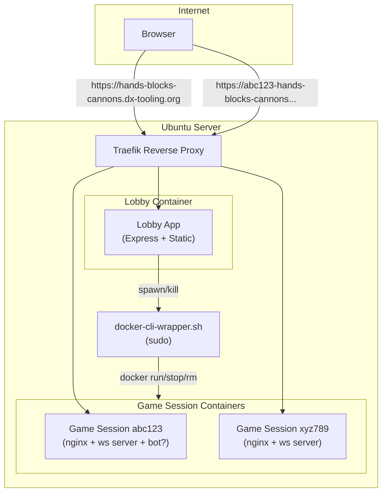

# Lobby Application for Hands Blocks Cannons

## Architecture Overview




## New Package: `@block-game/lobby`

Create [`packages/lobby/`](packages/lobby/) with the same TypeScript/Vite stack as the other packages.

### Core Components

| Component | Purpose ||-----------|---------|| Express server | Serves static frontend + REST API for session management || Session store | In-memory map of active sessions with cleanup on container death || Docker spawner | Calls `docker-cli-wrapper.sh` via `child_process.execFile` || Frontend UI | Simple SPA for creating/joining games |

### API Endpoints

```javascript
POST /api/sessions          Create new session (returns sessionId + joinUrl)
GET  /api/sessions/:id      Get session status (active/waiting/ended)
DELETE /api/sessions/:id    End session (stop + remove container)
```


### Session Flow

1. User visits lobby at `https://hands-blocks-cannons.dx-tooling.org`
2. Chooses "Play vs Bot" or "Play vs Human"
3. Lobby generates unique session ID (e.g., `abc123`)
4. Lobby spawns Docker container with Traefik labels for `abc123-hands-blocks-cannons.dx-tooling.org`
5. User is redirected to game URL; for human opponent, shareable URL is displayed

## Docker Setup

### Game Session Container

Create [`docker/game-session/Dockerfile`](docker/game-session/Dockerfile):

- Base: `node:24-bookworm-slim` (Debian-based)
- Contains: nginx (static client) + game server + optional bot process
- Single port 80: nginx serves static files and proxies `/ws` to game server
- Environment variables: `SESSION_ID`, `WITH_BOT` (true/false), `BOT_DIFFICULTY`

### Lobby Container

Create [`docker/lobby/Dockerfile`](docker/lobby/Dockerfile):

- Base: `node:24-bookworm-slim` (Debian-based)
- Contains: lobby Express app
- Port 80

### Docker CLI Wrapper

Create [`bin/docker-cli-wrapper.sh`](bin/docker-cli-wrapper.sh):

```bash
ALLOWED_CMDS=("run" "stop" "rm" "ps" "inspect")
CONTAINER_RE='^hbc-session-[a-z0-9]+$'
IMAGE_NAME="hbc-game-session"
```

Validates:

- Only allowed Docker subcommands
- Container names must match `hbc-session-*` pattern
- Only the `hbc-game-session` image can be run

### Docker Compose (root level)

Create [`docker-compose.yml`](docker-compose.yml) for production deployment:

```yaml
services:
  lobby:
    build: ./docker/lobby
    labels:
            - "traefik.enable=true"
            - "outermost_router.enable=true"
            - "traefik.docker.network=outermost_router"
            - "traefik.http.routers.hbc-lobby.rule=Host(`hands-blocks-cannons.dx-tooling.org`)"
            - "traefik.http.routers.hbc-lobby.entrypoints=websecure"
            - "traefik.http.routers.hbc-lobby.tls=true"
            - "traefik.http.services.hbc-lobby.loadbalancer.server.port=80"
    volumes:
            - ./bin/docker-cli-wrapper.sh:/app/bin/docker-cli-wrapper.sh:ro
    networks:
            - outermost_router
```

Game session containers are spawned dynamically with labels:

```yaml
labels:
    - "traefik.enable=true"
    - "outermost_router.enable=true"
    - "traefik.docker.network=outermost_router"
    - "traefik.http.routers.hbc-{sessionId}.rule=Host(`{sessionId}-hands-blocks-cannons.dx-tooling.org`)"
    - "traefik.http.routers.hbc-{sessionId}.entrypoints=websecure"
    - "traefik.http.routers.hbc-{sessionId}.tls=true"
    - "traefik.http.services.hbc-{sessionId}.loadbalancer.server.port=80"
```


## WebSocket via Traefik

Inside each game container, nginx listens on port 80 and:

- Serves static client files at `/`
- Proxies WebSocket connections at `/ws` to the local game server (port 3001)

The client connects to `wss://{sessionId}-hands-blocks-cannons.dx-tooling.org/ws` - same origin, no CORS issues.

## Build and Deployment Strategy

All builds happen on the target Ubuntu server. No cross-compilation or container registries needed.**Two separate build steps:**

1. **Game session image** - built manually (used by lobby to spawn game containers):
   ```bash
         docker build -t hbc-game-session ./docker/game-session
   ```


This image must exist before the lobby can spawn game sessions.

2. **Lobby container** - managed by docker-compose:
   ```bash
         docker compose up --build -d
   ```


This builds and starts the lobby application.**Full deployment workflow:**

```bash
# On Ubuntu server, in project directory
git clone <repo-url>                                    # First time only
# or: git pull                                          # For updates

docker build -t hbc-game-session ./docker/game-session  # Build game image
docker compose up --build -d                            # Build + start lobby
```


## Documentation Requirements

The project README will provide comprehensive, step-by-step instructions for anyone with basic Linux/Docker knowledge:

1. **Prerequisites**

                - Ubuntu 24.04 server with Docker installed
                - Existing Traefik reverse proxy setup with `outermost_router` network
                - TLS certificates (via Traefik's ACME/Let's Encrypt)

2. **DNS Configuration**

                - A record for `hands-blocks-cannons.dx-tooling.org`
                - Wildcard A record for `*.hands-blocks-cannons.dx-tooling.org` (for game sessions)

3. **Sudoers Setup**

                - Exact file contents for `/etc/sudoers.d/` entry
                - Which user needs the permission (the user running the lobby container)
                - How to verify it works

4. **Deployment Steps**

                - Clone repository
                - Build game session image
                - Start lobby with docker compose
                - Verify Traefik picks up the container

5. **Verification Checklist**

                - How to confirm lobby is accessible
                - How to test game session creation
                - How to check container logs

6. **Troubleshooting**

                - Common issues (DNS propagation, Traefik not routing, sudoers permission denied)
                - Log locations and debugging commands

## Implementation Todos

Files to create:

- `packages/lobby/` - new monorepo package
- `docker/game-session/` - Dockerfile + nginx config
- `docker/lobby/` - Dockerfile
- `bin/docker-cli-wrapper.sh` - secure Docker CLI wrapper