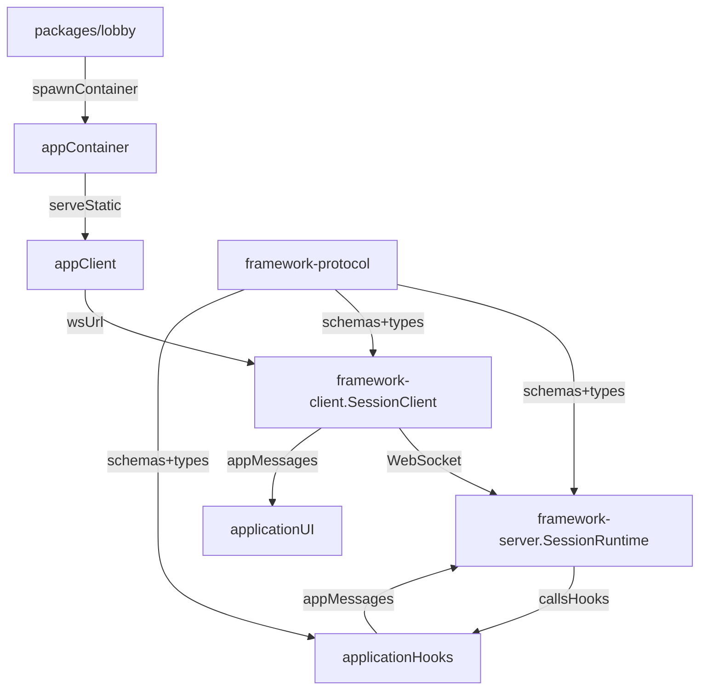

# Thorough cleanup plan (architecture + protocol)

### Goals

- **One canonical session protocol**: framework-level messages are fully typed + runtime-validated, and apps compose their messages on top.
- **One runtime**: all applications (including `blocks-cannons`) run on `@gesture-app/framework-server` (`SessionRuntime`) and clients use `@gesture-app/framework-client` (`SessionClient`).
- **Breaking cleanup**: remove `game_*` / `player_*` legacy message aliases and stop spreading welcome data into top-level fields.
- **No more `as unknown as ...` at the protocol boundary**.

### Target end-state (dataflow)

### Phase 1 — Make `@gesture-app/framework-protocol` the real contract

- **Define all framework messages as Zod schemas + TS types** in:
- [`packages/framework/protocol/src/index.ts`](packages/framework/protocol/src/index.ts)
- (likely new) [`packages/framework/protocol/src/messages.ts`](packages/framework/protocol/src/messages.ts)
- **Canonical framework messages (no aliases)**
- Client → server: `participant_ready`, `bot_identify`, `play_again_vote`
- Server → client: `welcome`, `opponent_joined`, `opponent_left`, `session_started`, `session_ended`, `play_again_status`, `session_reset`, `error`
- **Key shape change** (removes spreading/casts):
- `welcome` becomes `{ participantId, participantNumber, sessionPhase, appData }`
- `session_reset` becomes `{ appData }`
- `opponent_joined` supports `{ appData? }` (lets apps send “opponent snapshot” without inventing a parallel message)
- `session_ended` supports optional `winnerId/winnerNumber` plus `reason` (framework-level) and optional `appData` (app-level detail)
- **Composition helpers** so each app can build a single discriminated union schema without duplicating framework schemas:
- `createSessionClientMessageSchema(appClientSchemas)`
- `createSessionServerMessageSchema({ appServerSchemas, welcomeAppDataSchema, opponentJoinedAppDataSchema, resetAppDataSchema, sessionEndedAppDataSchema })`

### Phase 2 — Refactor framework runtimes to use canonical protocol

- **Server runtime**: update [`packages/framework/server/src/SessionRuntime.ts`](packages/framework/server/src/SessionRuntime.ts)
- Replace all `as unknown as TServerMessage` sends with **real framework message types**.
- Stop spreading welcome/reset data into the message root; always send `appData`.
- Remove legacy handling of `player_ready`.
- Improve lifecycle correctness:
    - On disconnect during `playing`, send `session_ended` with reason `participant_left` (and stop tick loop), then broadcast `opponent_left`.
- Add a hook for opponent-join payload (needed for blocks-cannons):
    - e.g. `onOpponentJoined?(joiningParticipant: Participant): TOpponentJoinedData | undefined`
- **Client runtime**: update [`packages/framework/client/src/SessionClient.ts`](packages/framework/client/src/SessionClient.ts)
- Remove legacy message set (`game_*`, `player_*`).
- Parse framework messages using the new schemas.
- Pass typed `appData` to events:
    - `onSessionJoin({ ..., appData })`
    - `onOpponentJoined(appData?)`
    - `onSessionReset(appData?)`
    - `onSessionEnd({ winner?, reason, appData? })`

### Phase 3 — Migrate `hello-hands` to the unified client/server model

- **Server** (already on `SessionRuntime`):
- Update [`packages/applications/hello-hands/src/server/HelloHandsSession.ts`](packages/applications/hello-hands/src/server/HelloHandsSession.ts) to the new `AppHooks` signature and canonical framework messages.
- Use schema composition from Phase 1 for parsing/serialization.
- **Client**:
- Replace custom WebSocket/session-config code in [`packages/applications/hello-hands/client/main.ts`](packages/applications/hello-hands/client/main.ts) with:
    - `resolveSessionConfig()` from [`packages/framework/client/src/SessionConfig.ts`](packages/framework/client/src/SessionConfig.ts)
    - `SessionClient` from [`packages/framework/client/src/SessionClient.ts`](packages/framework/client/src/SessionClient.ts)
- Make “raise hand → sendReady” call `SessionClient.sendReady()` (no casting).
- **Packaging**:
- Add dependency on `@gesture-app/framework-client` to `hello-hands/package.json` and update the Hello Hands docker build to include/build `framework-client`:
    - [`packages/applications/hello-hands/docker/Dockerfile`](packages/applications/hello-hands/docker/Dockerfile)

### Phase 4 — Migrate `blocks-cannons` fully onto the framework runtime

- **Protocol split**: update [`packages/applications/blocks-cannons/src/shared/protocol.ts`](packages/applications/blocks-cannons/src/shared/protocol.ts)
- Remove framework/lifecycle messages from the app protocol (`welcome`, `opponent_*`, `game_*`, `play_again_*`, `error`, `bot_identify`, `player_ready`).
- Introduce app-data schemas used inside framework messages:
    - `BlocksWelcomeData` (blocks, projectiles, room, cameraDistance, wallGrid, projectileSize)
    - `BlocksOpponentJoinedData` (opponent blocks)
    - `BlocksResetData` (fresh blocks)
    - optionally `BlocksSessionEndedData` (e.g. `appReason: 'blocks_destroyed'`)
- Keep only true gameplay messages as app messages (block/cannon/projectile updates).
- **Server**: replace the bespoke server lifecycle in [`packages/applications/blocks-cannons/src/server/server.ts`](packages/applications/blocks-cannons/src/server/server.ts)
- Create `BlocksCannonsHooks` (new file, e.g. `src/server/BlocksCannonsSession.ts`) implementing `AppHooks`.
- Move tick/update logic into `onTick` and win-condition into `checkSessionEnd`.
- Remove custom play-again handling and let `SessionRuntime` own it.
- Keep `InactivityMonitor` as a thin outer concern (optional) around runtime.
- **Client**:
- Replace [`packages/applications/blocks-cannons/client/network/GameClient.ts`](packages/applications/blocks-cannons/client/network/GameClient.ts) with a `SessionClient`-based adapter (keep the same callbacks `Game` expects to reduce churn).
- Update [`packages/applications/blocks-cannons/client/main.ts`](packages/applications/blocks-cannons/client/main.ts) to read welcome data from `welcome.appData` and to react to `session_started/session_ended/session_reset` via `SessionClient` events.
- **Bot**:
- Update [`packages/applications/blocks-cannons/src/server/bot/BotClient.ts`](packages/applications/blocks-cannons/src/server/bot/BotClient.ts) to:
    - Read initial state from `welcome.appData` (instead of top-level `welcome.blocks`, etc.)
    - React to `session_started/session_ended/session_reset`
    - Continue sending `bot_identify` and `play_again_vote` as framework client messages

### Phase 5 — Lobby + infra configuration cleanup

- Centralize lobby config (base domain, docker network, wrapper path) into a single module and stop hardcoding `dx-tooling.org` in multiple places:
- [`packages/lobby/src/services/DockerSpawner.ts`](packages/lobby/src/services/DockerSpawner.ts)
- [`packages/lobby/src/services/SessionStore.ts`](packages/lobby/src/services/SessionStore.ts)
- Tighten `AppManifest.id` validation to a “docker + DNS safe” subset (since it’s used in container names/hostnames):
- [`packages/framework/protocol/src/registry.ts`](packages/framework/protocol/src/registry.ts)

### Phase 6 — Cleanup + documentation

- Update the outdated workspace rule doc to match the real monorepo layout:
- [`/.cursor/rules/project-structure.mdc`](.cursor/rules/project-structure.mdc)
- Add a short architecture doc describing:
- the canonical session protocol
- how to build an app protocol on top
- how the lobby discovers/registers apps

### Acceptance criteria

- No legacy message names remain (`game_*`, `player_*`) anywhere in `packages/`.
- No `as unknown as` used to cross the wire at the framework boundary.
- `hello-hands` and `blocks-cannons` both:
- connect via `resolveSessionConfig()`