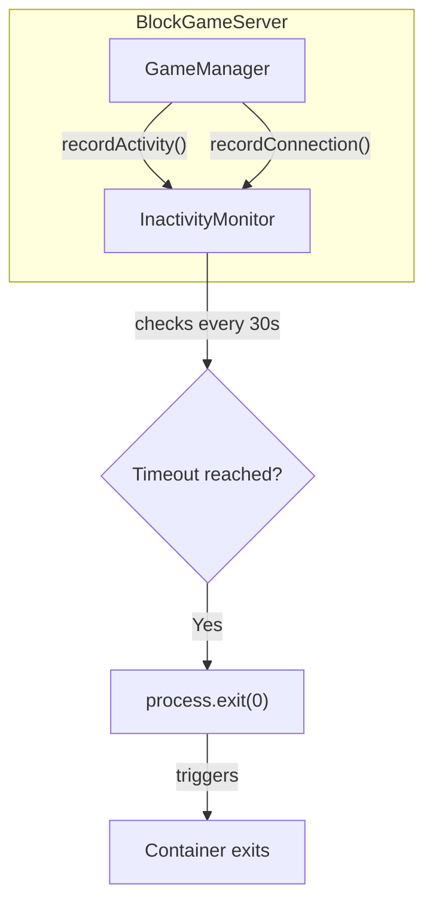

# Server Inactivity Timeout

## Architecture

## Implementation

### 1. Create InactivityMonitor class

Create new file [`packages/server/src/utils/InactivityMonitor.ts`](packages/server/src/utils/InactivityMonitor.ts):

- Track `lastActivityTime` (updated on any message)
- Track `connectionCount` (incremented/decremented on connect/disconnect)
- Track `hasEverConnected` flag
- Run a check interval (every 30 seconds)
- Support configurable timeout via `INACTIVITY_TIMEOUT_MS` env var (default: 300000ms = 5 min)
- Call shutdown callback when either condition met:
- No player has ever connected AND startup timeout reached
- No players connected AND last activity timeout reached

### 2. Integrate with BlockGameServer

Modify [`packages/server/src/server.ts`](packages/server/src/server.ts):

- Instantiate `InactivityMonitor` with shutdown callback
- Call `monitor.recordActivity()` when messages are received
- Call `monitor.recordConnection(true)` on new connections
- Call `monitor.recordConnection(false)` on disconnections
- Stop monitor in `close()` method

### 3. Shutdown handling

Modify [`packages/server/src/index.ts`](packages/server/src/index.ts):

- Pass shutdown callback that logs reason and calls `process.exit(0)`
- Container will exit automatically (entrypoint uses `wait -n`)

### 4. Configuration

Add to [`packages/server/config/game.yaml`](packages/server/config/game.yaml) (optional):

- Add `inactivityTimeout` setting with default 300000ms
- Or simply use environment variable `INACTIVITY_TIMEOUT_MS`