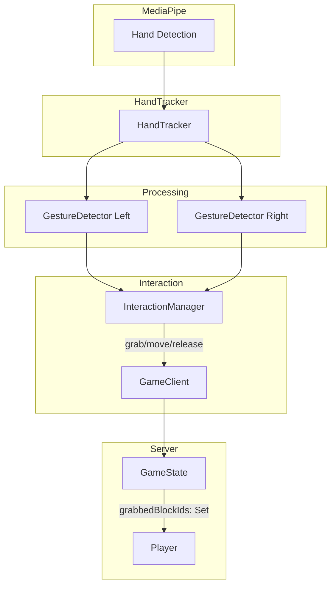

# Two-Hand Interaction Support

## Phase 1: Two-Hand Visualization (Low Risk)

Update the hand tracking pipeline to detect and visualize both hands without changing interaction logic.**Files to modify:**

- [`packages/client/src/constants.ts`](packages/client/src/constants.ts) - Change `MAX_HANDS` from 1 to 2
- [`packages/client/src/input/HandTracker.ts`](packages/client/src/input/HandTracker.ts) - Pass all detected hands to callback
- [`packages/client/src/types.ts`](packages/client/src/types.ts) - Add multi-hand types
- [`packages/client/src/input/HandVisualizer.ts`](packages/client/src/input/HandVisualizer.ts) - Render multiple hands with distinct colors
- [`packages/client/src/main.ts`](packages/client/src/main.ts) - Store array of hand landmarks

**Key changes:**

- Callback signature: `HandLandmarks | null` becomes `HandLandmarks[] | null`
- Each hand gets a distinct color (e.g., blue for left, green for right)
- Use MediaPipe's `multiHandedness` to identify left/right hands

---

## Phase 2: Client-Side Two-Hand Interaction (Medium Risk)

Enable grabbing blocks with either hand independently.**Files to modify:**

- [`packages/client/src/input/GestureDetector.ts`](packages/client/src/input/GestureDetector.ts) - Process gestures for each hand
- [`packages/client/src/game/InteractionManager.ts`](packages/client/src/game/InteractionManager.ts) - Track two grabbed blocks
- [`packages/client/src/scene/BlockRenderer.ts`](packages/client/src/scene/BlockRenderer.ts) - Support two grabbed highlights
- [`packages/client/src/main.ts`](packages/client/src/main.ts) - Process both hands in game loop

**Key design decisions:**

- Track state per hand: `{ left: BlockEntity | null, right: BlockEntity | null }`
- Prevent same block from being grabbed by both hands
- Independent grace periods for each hand's release

---

## Phase 3: Server-Side Support (Medium-High Risk)

Update server state and protocol to support multiple simultaneous grabs per player.**Files to modify:**

- [`packages/shared/src/types/index.ts`](packages/shared/src/types/index.ts) - Change `Player.grabbedBlockId` type
- [`packages/server/src/game/GameState.ts`](packages/server/src/game/GameState.ts) - Update grab/release methods
- [`packages/server/src/protocol/handlers.ts`](packages/server/src/protocol/handlers.ts) - Handle multiple grabs
- [`packages/server/src/bot/BotClient.ts`](packages/server/src/bot/BotClient.ts) - Update bot to work with new schema

**State change:**

```typescript
// From:
grabbedBlockId: BlockId | null

// To:
grabbedBlockIds: Set<BlockId>  // or array, max 2 elements
```

---

## Phase 4: Testing and Edge Cases

Update existing tests and add new test cases.**Test files to update:**

- [`packages/server/tests/GameState.test.ts`](packages/server/tests/GameState.test.ts)
- [`packages/client/tests/InteractionManager.test.ts`](packages/client/tests/InteractionManager.test.ts)
- [`packages/client/tests/GestureDetector.test.ts`](packages/client/tests/GestureDetector.test.ts)

**New test scenarios:**

- Grabbing two blocks simultaneously
- Releasing one hand while other holds
- Both hands reaching for same block
- Hand identity swap handling

---

## Architecture Diagram



---

## Risk Mitigation

| Risk | Mitigation ||------|------------|| Hand identity swapping | Use spatial tracking - if hands swap IDs but positions are close to previous frame, maintain identity || Performance impact | Profile after Phase 1; MediaPipe handles 2 hands well || Breaking existing single-hand flow | Phase 1 is backward compatible; can abort later phases if issues arise |---

## Estimated Effort